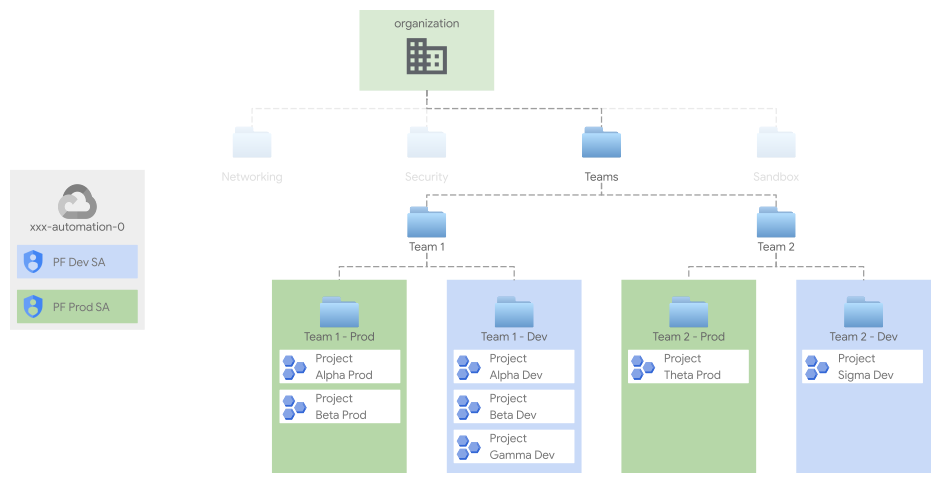

# Project factory

The Project Factory (or PF) builds on top of your foundations to create and set up projects (and related resources) to be used for your workloads.
It is organized in folders representing environments (e.g., "dev", "prod"), each implemented by a stand-alone terraform [process factory](../../../../blueprints/factories/README.md).

## Design overview and choices

<p align="center">
  
</p>

A single factory creates projects in a well-defined context, according to your resource management structure. For example, in the diagram above, each Team is structured to have specific folders projects for a given environment, such as Production and Development, per the resource management structure configured in stage `01-resman`.

Projects for each environment across different teams are created by dedicated service accounts, as exemplified in the diagram above. While there's no intrinsic limitation regarding where the project factory can create a projects, the IAM bindings for the service account effectively enforce boundaries (e.g., the production service account shouldn't be able to create or have any access to the development projects, and vice versa).

The project factory stage lightly wraps the underlying [project-factory module](../../../../modules/project-factory/), including Shared VPC service project attachment, VPC SC perimeter membership, etc.
  
## CIDR Table  
The Distribution of the CIDR as per Organization, Tenants and Projects
| Component  | CIDR | Notes |
| ------------- | ------------- |------------- |
| Organization (All Tenants)  | 10.200.0.0/16  | 8 Tenants per Organization|
| Tenants 1  | 10.200.3.0/19  | 8 projects per tenant|
| Project 1   | 10.200.2.0/23  | |
| Project 2   | 10.200.4.0/23  | |
| Project 3   | 10.200.6.0/23  | |
| Project 4   | 10.200.8.0/23  | |
| Project 5   | 10.200.10.0/23  | |

Utilize the above table to create new project with CIDRs. The 10.200.0.0/16 is an tenant subnet.

## How to run this stage

This stage is meant to be executed after "foundational stages" (i.e., stages [`00-bootstrap`](../../0-bootstrap), [`01-resman`](../../1-resman), 02-networking (either [VPN](../../2-networking-b-vpn), [NVA](../../2-networking-c-nva), [NVA with BGP support](../../2-networking-e-nva-bgp)) and [`02-security`](../../2-security)) have been run.

It's of course possible to run this stage in isolation, by making sure the architectural prerequisites are satisfied (e.g., networking), and that the Service Account running the stage is granted the appropriate roles.

### Setting default Pproject for manual run
**Important**: Before running this, make sure that if you are running these stages manually from the command line, that your default project is set to the 'automation' project created in 0-bootstrap.
To find the 'automation' project,
```bash
pushd ../../0-bootstrap
terraform output project_ids
popd
```
And to set the gcloud project default in your CLI
```bash
gcloud config set project <prefix>-prod-iac-core-0
```

### Provider and Terraform variables

As all other FAST stages, the [mechanism used to pass variable values and pre-built provider files from one stage to the next](../../0-bootstrap/README.md#output-files-and-cross-stage-variables) is also leveraged here.

The commands to link or copy the provider and terraform variable files can be easily derived from the `stage-links.sh` script in the FAST root folder, passing it a single argument with the local output files folder (if configured) or the GCS output bucket in the automation project (derived from stage 0 outputs). The following examples demonstrate both cases, and the resulting commands that then need to be copy/pasted and run.

```bash
../../../stage-links.sh gs://xxx-prod-iac-core-outputs-0

# copy and paste the following commands for '3-project-factory'

gcloud alpha storage cp gs://xxx-prod-iac-core-outputs-0/providers/3-project-factory-providers.tf ./
gcloud alpha storage cp gs://xxx-prod-iac-core-outputs-0/tfvars/0-globals.auto.tfvars.json ./
gcloud alpha storage cp gs://xxx-prod-iac-core-outputs-0/tfvars/0-bootstrap.auto.tfvars.json ./
gcloud alpha storage cp gs://xxx-prod-iac-core-outputs-0/tfvars/1-resman.auto.tfvars.json ./
gcloud alpha storage cp gs://xxx-prod-iac-core-outputs-0/tfvars/2-networking.auto.tfvars.json ./
gcloud alpha storage cp gs://xxx-prod-iac-core-outputs-0/tfvars/2-security.auto.tfvars.json ./
```

If you're not using FAST, refer to the [Variables](#variables) table at the bottom of this document for a full list of variables, their origin (e.g., a stage or specific to this one), and descriptions explaining their meaning.
### Creating the YAML Files

The project factory is driven by YAML data files, with one file per project. Please refer to the underlying [project factory module](../../../../modules/project-factory/) documentation for details on the format.
The project factory module implements end-to-end creation processes for a folder hierarchy, projects, VPC with CIDR via YAML data configurations.

Service accounts and buckets will be prefixed with the project name, and use the key specified in the YAML file as a suffix. The YAML files are located in dev/data/projects directory.

```
# file name: project-dev.yaml
labels:
 team: dino-runner
 # Name of the team
parent: folders/173507323014
#Parent Folder
name: project-name
#Name of the project
subnetcidr: 10.200.2.0/23
#The CIDR Address given to the VPC
subnetregion: us-east4
# The GCP Region of the VPC
descriptive_name: Ashley 
# The project descriptive name

services:
- compute.googleapis.com
- storage.googleapis.com

```
### Updating the variables 

- Update the variables using the variables.tf or terraform.tfvars the details about each required variables is listed in section "Variables"
- There is a sample terraform.tfvars.sample available

Once the configuration is complete, run the project factory with:

```bash
terraform init
terraform apply
```

<!-- TFDOC OPTS files:1 show_extra:1 -->
<!-- BEGIN TFDOC -->
## Files

| name | description | modules |
|---|---|---|
| [main.tf](./main.tf) | Project factory. | <code>net-vpc</code> · <code>net-vpc-peering</code> · <code>project-factory</code> |
| [outputs.tf](./outputs.tf) | Module outputs. |  |
| [variables.tf](./variables.tf) | Module variables. |  |

## Variables

| name | description | type | required | default | producer |
|---|---|:---:|:---:|:---:|:---:|
| [billing_account](variables.tf#L18) | Billing account id. If billing account is not part of the same org set `is_org_level` to false. | <code title="object&#40;&#123;&#10;  id           &#61; string&#10;  is_org_level &#61; optional&#40;bool, true&#41;&#10;&#125;&#41;">object&#40;&#123;&#8230;&#125;&#41;</code> | ✓ |  | <code>0-bootstrap</code> |
| [prefix](variables.tf#L63) | Prefix used for resources that need unique names. Use 9 characters or less. | <code>string</code> | ✓ |  | <code>0-bootstrap</code> |
| [factories_config](variables.tf#L31) | Path to folder with YAML resource description data files. | <code title="object&#40;&#123;&#10;  projects_data_path &#61; string&#10;  budgets &#61; optional&#40;object&#40;&#123;&#10;    billing_account       &#61; string&#10;    budgets_data_path     &#61; string&#10;    notification_channels &#61; optional&#40;map&#40;any&#41;, &#123;&#125;&#41;&#10;  &#125;&#41;&#41;&#10;&#125;&#41;">object&#40;&#123;&#8230;&#125;&#41;</code> |  | <code title="&#123;&#10;  projects_data_path &#61; &#34;data&#47;projects&#34;&#10;&#125;">&#123;&#8230;&#125;</code> |  |
| [host_project_ids](variables.tf#L47) | Map of host projects from the networks stages. | <code>map&#40;string&#41;</code> |  | <code>&#123;&#125;</code> | <code>3-network</code> |
| [location](variables.tf#L56) | Location of the Compute Engine VM. | <code>string</code> |  | <code>&#34;us-east4&#34;</code> |  |
| [vpc_self_links](variables.tf#L73) | Map of projects and VPC from the networks stages. | <code>map&#40;string&#41;</code> |  | <code>&#123;&#125;</code> | <code>3-network</code> |

## Outputs

| name | description | sensitive | consumers |
|---|---|:---:|---|
| [projects](outputs.tf#L17) | Created projects. |  |  |
| [service_accounts](outputs.tf#L27) | Created service accounts. |  |  |
| [vpcs-subnets](outputs.tf#L32) | Created projects. |  |  |
<!-- END TFDOC -->
